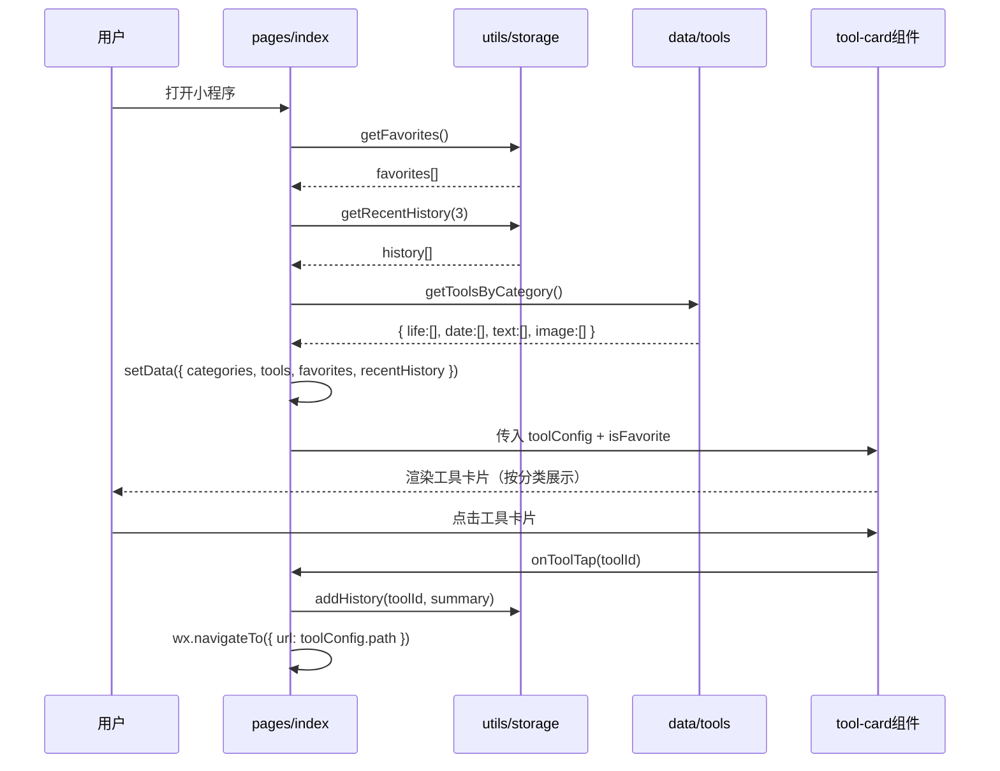
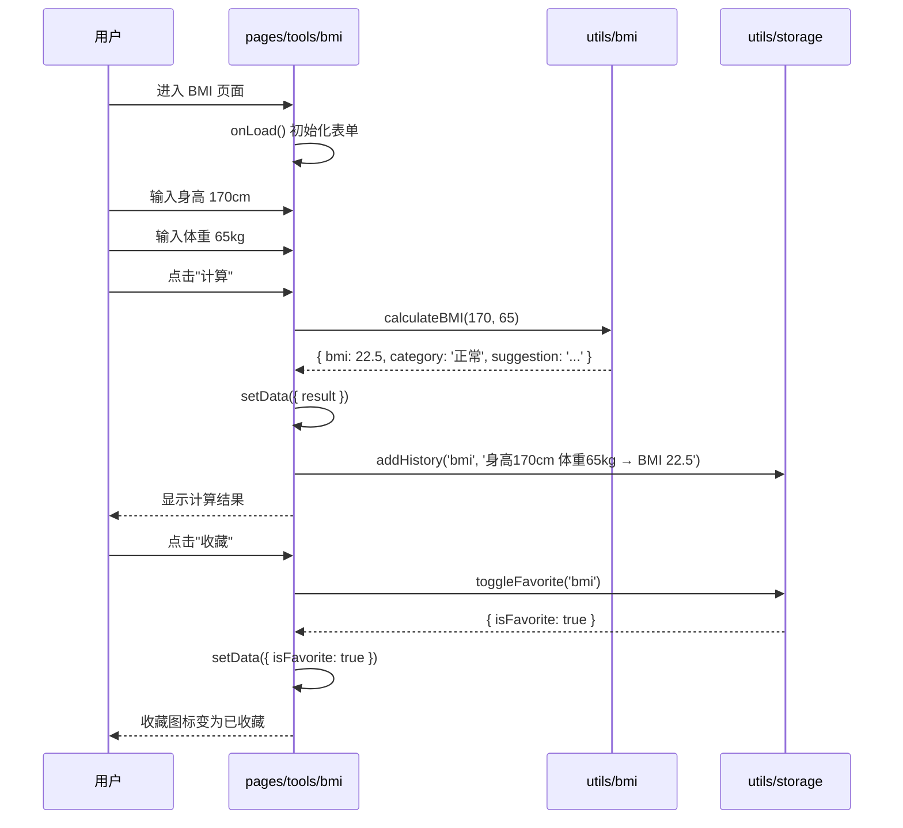
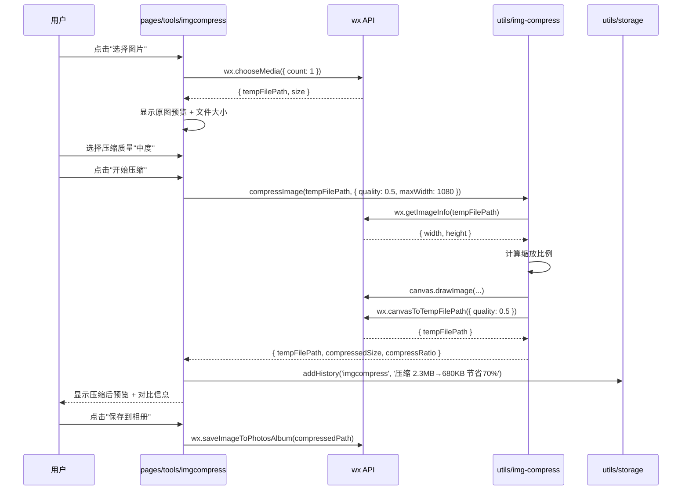
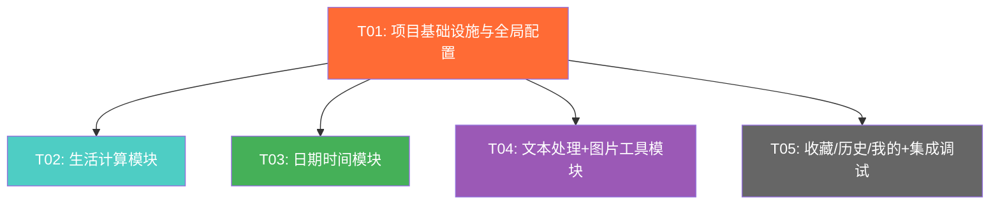

# 微信小程序工具箱 - 系统架构设计文档

> 架构师：高见远 | 版本：v1.0 | 日期：2026-05-29

---

## 1. 技术选型与实现方案

### 1.1 核心技术决策

| 技术点 | 选型 | 原因 |
|--------|------|------|
| 开发框架 | 原生微信小程序 | PRD 明确要求，无需额外框架开销，包体积最小 |
| UI 实现 | 原生 WXML + WXSS | 不引入第三方 UI 库，保持轻量，完全自定义风格 |
| 状态管理 | Page data + 本地存储 | 小程序天然单页面栈，无需全局状态库 |
| 二维码生成 | weapp-qrcode（本地 utils 引入） | 轻量纯 JS 库，无 canvas 兼容问题，支持中文 |
| 图片压缩 | Canvas API（wx.canvasToTempFilePath） | 纯前端实现，无需服务端，隐私安全 |
| 图片转 Base64 | wx.getFileSystemManager + readFile | 原生 API，编码为 base64 格式 |
| 汇率数据 | 内置静态 JSON + 手动输入比例 | 首版无需网络请求，离线可用 |
| 节假日数据 | 内置 2026 年 JSON | 轻量可靠，无需联网 |
| 本地存储 | wx.setStorageSync / wx.getStorageSync | 收藏、历史、用户偏好持久化 |
| 农历计算 | 纗线算法（lunar.js） | 纯 JS 实现，精度满足日常使用 |

### 1.2 架构模式

采用 **模块化分层架构**：

```
┌─────────────────────────────────────┐
│            Pages（页面层）            │  19 个页面
├─────────────────────────────────────┤
│         Components（组件层）          │  可复用 UI 组件
├─────────────────────────────────────┤
│          Utils（工具层）              │  计算、转换、存储
├─────────────────────────────────────┤
│          Data（数据层）               │  静态配置、节假日、汇率
├─────────────────────────────────────┤
│          App（应用层）                │  全局配置、生命周期
└─────────────────────────────────────┘
```

### 1.3 关键技术难点与方案

1. **万年历月视图 + 农历 + 节假日标注**：需自行实现月历网格算法，农历转换使用查表法（1900-2100 年数据表），节假日通过日期匹配叠加标注
2. **图片压缩质量平衡**：Canvas 重绘时通过 quality 参数分级压缩，提供"轻度/中度/重度"三档
3. **工作日计算**：需同时排除周末和法定节假日，考虑调休上班日（周末变工作日），2026 年数据需精确维护
4. **税后工资计算**：需实现 2024 年个税累进税率表 + 标准社保公积金比例扣除

---

## 2. 完整文件结构

```
toolbox-miniapp/
├── app.js                          # 小程序入口，全局生命周期
├── app.json                        # 全局配置（pages、tabBar、window）
├── app.wxss                        # 全局样式（主题变量、通用样式）
├── project.config.json             # 项目配置
├── sitemap.json                    # 站点地图
│
├── data/
│   ├── tools.js                    # 工具配置数据（16 个工具的元信息）
│   ├── holidays-2026.js            # 2026 年法定节假日 + 调休数据
│   ├── exchange-rates.js           # 内置主要币种汇率数据
│   └── lunar-table.js              # 农历查表数据（1900-2100）
│
├── utils/
│   ├── storage.js                  # 本地存储封装（收藏、历史、偏好）
│   ├── lunar.js                    # 农历计算核心（公历↔农历转换）
│   ├── calendar.js                 # 万年历月视图网格计算
│   ├── bmi.js                      # BMI 计算逻辑
│   ├── unit.js                     # 单位换算逻辑（长度/重量/温度）
│   ├── currency.js                 # 汇率转换逻辑
│   ├── salary.js                   # 税后工资计算逻辑
│   ├── workday.js                  # 工作日计算逻辑
│   ├── text.js                     # 文本处理（字数统计、大小写转换）
│   ├── json-format.js              # JSON 格式化/校验
│   ├── base64.js                   # Base64 编解码
│   ├── img-compress.js             # 图片压缩（Canvas 处理）
│   ├── img-base64.js               # 图片转 Base64
│   └── qrcode.js                   # weapp-qrcode 库（本地引入）
│
├── components/
│   ├── tool-card/                  # 工具卡片组件（首页/分类展示）
│   │   ├── tool-card.js
│   │   ├── tool-card.json
│   │   ├── tool-card.wxml
│   │   └── tool-card.wxss
│   ├── section-header/             # 分类标题组件
│   │   ├── section-header.js
│   │   ├── section-header.json
│   │   ├── section-header.wxml
│   │   └── section-header.wxss
│   ├── calendar-grid/              # 万年历网格组件
│   │   ├── calendar-grid.js
│   │   ├── calendar-grid.json
│   │   ├── calendar-grid.wxml
│   │   └── calendar-grid.wxss
│   └── empty-state/                # 空状态占位组件
│       ├── empty-state.js
│       ├── empty-state.json
│       ├── empty-state.wxml
│       └── empty-state.wxss
│
├── pages/
│   ├── index/                      # 首页（工具列表）
│   │   ├── index.js
│   │   ├── index.json
│   │   ├── index.wxml
│   │   └── index.wxss
│   ├── favorites/                  # 收藏页
│   │   ├── index.js
│   │   ├── index.json
│   │   ├── index.wxml
│   │   └── index.wxss
│   ├── history/                    # 历史页
│   │   ├── index.js
│   │   ├── index.json
│   │   ├── index.wxml
│   │   └── index.wxss
│   ├── mine/                       # 我的
│   │   ├── index.js
│   │   ├── index.json
│   │   ├── index.wxml
│   │   └── index.wxss
│   ├── tools/
│   │   ├── bmi/                    # BMI 计算
│   │   │   ├── index.js
│   │   │   ├── index.json
│   │   │   ├── index.wxml
│   │   │   └── index.wxss
│   │   ├── unit/                   # 单位换算
│   │   │   ├── index.js
│   │   │   ├── index.json
│   │   │   ├── index.wxml
│   │   │   └── index.wxss
│   │   ├── currency/               # 汇率转换
│   │   │   ├── index.js
│   │   │   ├── index.json
│   │   │   ├── index.wxml
│   │   │   └── index.wxss
│   │   ├── salary/                 # 税后工资
│   │   │   ├── index.js
│   │   │   ├── index.json
│   │   │   ├── index.wxml
│   │   │   └── index.wxss
│   │   ├── calendar/               # 万年历
│   │   │   ├── index.js
│   │   │   ├── index.json
│   │   │   ├── index.wxml
│   │   │   └── index.wxss
│   │   ├── countdown/              # 倒计时
│   │   │   ├── index.js
│   │   │   ├── index.json
│   │   │   ├── index.wxml
│   │   │   └── index.wxss
│   │   ├── workday/                # 工作日计算
│   │   │   ├── index.js
│   │   │   ├── index.json
│   │   │   ├── index.wxml
│   │   │   └── index.wxss
│   │   ├── lunar/                  # 农历转换
│   │   │   ├── index.js
│   │   │   ├── index.json
│   │   │   ├── index.wxml
│   │   │   └── index.wxss
│   │   ├── wordcount/              # 字数统计
│   │   │   ├── index.js
│   │   │   ├── index.json
│   │   │   ├── index.wxml
│   │   │   └── index.wxss
│   │   ├── caseconvert/            # 大小写转换
│   │   │   ├── index.js
│   │   │   ├── index.json
│   │   │   ├── index.wxml
│   │   │   └── index.wxss
│   │   ├── jsonformat/             # JSON 格式化
│   │   │   ├── index.js
│   │   │   ├── index.json
│   │   │   ├── index.wxml
│   │   │   └── index.wxss
│   │   ├── base64/                 # Base64 编解码
│   │   │   ├── index.js
│   │   │   ├── index.json
│   │   │   ├── index.wxml
│   │   │   └── index.wxss
│   │   ├── imgcompress/            # 图片压缩
│   │   │   ├── index.js
│   │   │   ├── index.json
│   │   │   ├── index.wxml
│   │   │   └── index.wxss
│   │   ├── imgbase64/              # 图片转 Base64
│   │   │   ├── index.js
│   │   │   ├── index.json
│   │   │   ├── index.wxml
│   │   │   └── index.wxss
│   │   └── qrcode/                 # 二维码生成
│   │       ├── index.js
│   │       ├── index.json
│   │       ├── index.wxml
│   │       └── index.wxss
│   └── tabbar/                     # TabBar 自定义（如需）
│
└── assets/
    └── icons/                      # 工具图标（各分类主题色图标）
        ├── bmi.png
        ├── unit.png
        ├── currency.png
        ├── salary.png
        ├── calendar.png
        ├── countdown.png
        ├── workday.png
        ├── lunar.png
        ├── wordcount.png
        ├── caseconvert.png
        ├── jsonformat.png
        ├── base64.png
        ├── imgcompress.png
        ├── imgbase64.png
        ├── qrcode.png
        ├── tab-home.png
        ├── tab-home-active.png
        ├── tab-fav.png
        ├── tab-fav-active.png
        ├── tab-history.png
        ├── tab-history-active.png
        ├── tab-mine.png
        └── tab-mine-active.png
```

---

## 3. 数据结构设计

### 3.1 工具配置数据结构（data/tools.js）

```javascript
// 工具分类枚举
const CATEGORIES = {
  LIFE_CALC:   { id: 'life',   name: '生活计算', color: '#FF6B35', icon: 'life'   },
  DATE_TIME:   { id: 'date',   name: '日期时间', color: '#4ECDC4', icon: 'date'   },
  TEXT_PROC:   { id: 'text',   name: '文本处理', color: '#45B058', icon: 'text'   },
  IMAGE_TOOL:  { id: 'image',  name: '图片工具', color: '#9B59B6', icon: 'image'  }
};

// 单个工具配置
const toolConfig = {
  id:          'bmi',                // String: 唯一标识，与页面路径对应
  name:        'BMI计算',            // String: 工具名称
  category:    'life',               // String: 所属分类 id
  icon:        'bmi',                // String: 图标名（对应 assets/icons/{icon}.png）
  path:        '/pages/tools/bmi/index',  // String: 页面路径
  description: '计算身体质量指数',    // String: 简短描述
  isFavorite:  false,                // Boolean: 是否默认收藏（运行时从 storage 读取覆盖）
};

// 完整工具列表：Array<typeof toolConfig>
const TOOLS = [ /* 16 个工具配置 */ ];

module.exports = { CATEGORIES, TOOLS };
```

### 3.2 收藏/历史记录存储结构

```javascript
// 收藏列表 - Storage Key: 'toolbox_favorites'
// 类型: Array<String>  （存储 toolId 列表）
const favorites = ['bmi', 'calendar', 'qrcode'];

// 历史记录 - Storage Key: 'toolbox_history'
// 类型: Array<HistoryRecord>
const history = [
  {
    toolId:    'bmi',                        // String: 工具 id
    toolName:  'BMI计算',                    // String: 工具名称（冗余存储，列表展示用）
    category:  'life',                       // String: 分类 id
    summary:   '身高170cm 体重65kg → BMI 22.5',  // String: 结果摘要
    timestamp: 1748524800000,                // Number: 时间戳（毫秒）
  }
];

// 用户偏好 - Storage Key: 'toolbox_preferences'
const preferences = {
  currencyBase:    'CNY',       // String: 汇率基准币种
  compressQuality: 'medium',    // String: 图片压缩默认质量 'light'|'medium'|'heavy'
  salaryCity:      'default',   // String: 税后工资城市（首版固定 default）
};
```

### 3.3 各工具核心计算模块接口（JS 函数签名）

```javascript
// ═══════════ 生活计算 ═══════════

// utils/bmi.js
/**
 * 计算 BMI
 * @param {number} height - 身高（cm）
 * @param {number} weight - 体重（kg）
 * @returns {{ bmi: number, category: string, suggestion: string }}
 *   category: '偏瘦'|'正常'|'偏胖'|'肥胖'
 */
function calculateBMI(height, weight) { ... }

// utils/unit.js
/**
 * 单位换算
 * @param {number} value      - 输入值
 * @param {string} fromUnit   - 源单位 key，如 'm', 'kg', 'celsius'
 * @param {string} toUnit     - 目标单位 key
 * @param {string} unitType   - 单位类型 'length'|'weight'|'temperature'
 * @returns {number} 换算结果
 */
function convertUnit(value, fromUnit, toUnit, unitType) { ... }

/**
 * 获取某类型的所有单位列表
 * @param {string} unitType - 'length'|'weight'|'temperature'
 * @returns {Array<{key: string, name: string, ratio: number}>}
 */
function getUnitList(unitType) { ... }

// utils/currency.js
/**
 * 汇率转换
 * @param {number} amount      - 金额
 * @param {string} fromCurrency - 源币种代码 'CNY'|'USD'|...
 * @param {string} toCurrency   - 目标币种代码
 * @returns {{ result: number, rate: number }}
 */
function convertCurrency(amount, fromCurrency, toCurrency) { ... }

/**
 * 获取所有币种列表
 * @returns {Array<{code: string, name: string, rate: number}>}
 *   rate 为对 USD 的汇率
 */
function getCurrencyList() { ... }

/**
 * 更新某币种的手动汇率
 * @param {string} code - 币种代码
 * @param {number} rate - 对 USD 的汇率
 */
function updateCurrencyRate(code, rate) { ... }

// utils/salary.js
/**
 * 计算税后工资
 * @param {number} grossSalary  - 税前月薪（元）
 * @param {number} socialBase   - 社保基数（默认等于 grossSalary）
 * @param {number} fundBase     - 公积金基数（默认等于 grossSalary）
 * @param {number} fundRate     - 公积金个人比例（5-12%，默认7%）
 * @returns {{
 *   grossSalary: number,
 *   socialInsurance: number,      // 社保个人部分
 *   housingFund: number,          // 公积金个人部分
 *   taxableIncome: number,        // 应纳税所得额
 *   incomeTax: number,            // 个人所得税
 *   netSalary: number,            // 税后工资
 *   deductionDetail: object       // 扣款明细
 * }}
 */
function calculateSalary(grossSalary, socialBase, fundBase, fundRate) { ... }

// ═══════════ 日期时间 ═══════════

// utils/lunar.js
/**
 * 公历转农历
 * @param {number} year   - 公历年
 * @param {number} month  - 公历月（1-12）
 * @param {number} day    - 公历日
 * @returns {{
 *   lunarYear: number, lunarMonth: number, lunarDay: number,
 *   lunarMonthName: string, lunarDayName: string,
 *   zodiac: string,    // 生肖
 *   ganZhi: string     // 干支纪年
 * }}
 */
function solarToLunar(year, month, day) { ... }

/**
 * 农历转公历
 * @param {number} year     - 农历年
 * @param {number} month    - 农历月（1-12，闰月为负如 -4 表示闰四月）
 * @param {number} day      - 农历日
 * @returns {{ year: number, month: number, day: number }}
 */
function lunarToSolar(year, month, day) { ... }

// utils/calendar.js
/**
 * 获取某月的日历网格数据
 * @param {number} year   - 年
 * @param {number} month  - 月（1-12）
 * @returns {Array<Array<{
 *   solarDay: number|null,
 *   lunarDayName: string,     // 农历日名（初一/十五/...）
 *   lunarMonthName: string,   // 农历月名（仅在初一显示）
 *   isToday: boolean,
 *   isHoliday: boolean,       // 是否法定节假日
 *   isWorkday: boolean,       // 是否调休工作日（周末上班）
 *   isWeekend: boolean,
 *   holidayName: string|null  // 节假日名称
 * }>>}
 *   外层数组 6 行，内层数组 7 列（周一→周日）
 */
function getCalendarGrid(year, month) { ... }

/**
 * 倒计时计算
 * @param {number} targetTimestamp - 目标时间戳（毫秒）
 * @param {number} currentTimestamp - 当前时间戳（毫秒）
 * @returns {{ days: number, hours: number, minutes: number, seconds: number, isPast: boolean }}
 */
function calculateCountdown(targetTimestamp, currentTimestamp) { ... }

// utils/workday.js
/**
 * 计算两个日期之间的工作日数
 * @param {string} startDate - 起始日期 'YYYY-MM-DD'
 * @param {string} endDate   - 结束日期 'YYYY-MM-DD'
 * @returns {{
 *   workdays: number,
 *   weekends: number,
 *   holidays: number,
 *   makeupDays: number,
 *   totalDays: number
 * }}
 */
function calculateWorkdays(startDate, endDate) { ... }

/**
 * 判断某日是否为工作日
 * @param {string} date - 日期 'YYYY-MM-DD'
 * @returns {{ isWorkday: boolean, reason: string }}
 *   reason: '工作日'|'周末'|'法定节假日:XX'|'调休上班'
 */
function isWorkday(date) { ... }

// ═══════════ 文本处理 ═══════════

// utils/text.js
/**
 * 字数统计
 * @param {string} text - 输入文本
 * @returns {{
 *   totalChars: number,      // 总字符数
 *   charNoSpace: number,     // 不含空格字符数
 *   chineseChars: number,    // 中文字符数
 *   englishWords: number,    // 英文单词数
 *   paragraphs: number,      // 段落数
 *   lines: number            // 行数
 * }}
 */
function countText(text) { ... }

/**
 * 大小写转换
 * @param {string} text   - 输入文本
 * @param {string} mode   - 'upper'|'lower'|'capitalize'|'sentence'|'toggle'
 * @returns {string}
 */
function convertCase(text, mode) { ... }

// utils/json-format.js
/**
 * JSON 格式化
 * @param {string} jsonStr - 输入 JSON 字符串
 * @param {number} indent  - 缩进空格数（默认 2）
 * @returns {{ success: boolean, result: string, error: string|null }}
 */
function formatJSON(jsonStr, indent) { ... }

/**
 * JSON 压缩（去除空格换行）
 * @param {string} jsonStr - 输入 JSON 字符串
 * @returns {{ success: boolean, result: string, error: string|null }}
 */
function minifyJSON(jsonStr) { ... }

// utils/base64.js
/**
 * Base64 编码
 * @param {string} str - 输入字符串
 * @returns {string} Base64 编码结果
 */
function encodeBase64(str) { ... }

/**
 * Base64 解码
 * @param {string} base64Str - Base64 字符串
 * @returns {{ success: boolean, result: string, error: string|null }}
 */
function decodeBase64(base64Str) { ... }

// ═══════════ 图片工具 ═══════════

// utils/img-compress.js
/**
 * 图片压缩（Canvas 方式）
 * @param {string} filePath        - 图片临时文件路径
 * @param {object} options
 * @param {number} options.quality - 压缩质量 0-1（默认 0.7）
 * @param {number} options.maxWidth - 最大宽度（默认 1080，超出等比缩放）
 * @returns {Promise<{
 *   tempFilePath: string,
 *   originalSize: number,
 *   compressedSize: number,
 *   compressRatio: string
 * }>}
 */
function compressImage(filePath, options) { ... }

// utils/img-base64.js
/**
 * 图片转 Base64
 * @param {string} filePath - 图片临时文件路径
 * @returns {Promise<{
 *   base64: string,
 *   mimeType: string,
 *   fileSize: number
 * }>}
 */
function imageToBase64(filePath) { ... }

// utils/qrcode.js（weapp-qrcode 封装）
/**
 * 生成二维码
 * @param {object} canvasContext - Canvas 上下文
 * @param {string} text         - 二维码内容
 * @param {object} options
 * @param {number} options.size      - 尺寸（默认 200）
 * @param {string} options.colorDark  - 前景色（默认 '#000000'）
 * @param {string} options.colorLight - 背景色（默认 '#FFFFFF'）
 * @param {number} options.correctLevel - 容错等级 1-3（默认 1）
 * @returns {Promise<void>}
 */
function generateQRCode(canvasContext, text, options) { ... }
```

---

## 4. 核心调用流程

### 4.1 首页加载流程



### 4.2 工具使用流程（以 BMI 为例）



### 4.3 图片压缩流程



---

## 5. 有序任务列表

### T01: 项目基础设施与全局配置

**文件**：
- `app.js`, `app.json`, `app.wxss`
- `project.config.json`, `sitemap.json`
- `data/tools.js`, `data/holidays-2026.js`, `data/exchange-rates.js`, `data/lunar-table.js`
- `utils/storage.js`
- `assets/icons/` (全部图标)
- `components/tool-card/` (4 文件)
- `components/section-header/` (4 文件)
- `components/empty-state/` (4 文件)
- `pages/index/` (4 文件)

**依赖**：无

**说明**：
1. 初始化微信小程序项目，配置 `app.json`（全部 19 个页面路由、tabBar、window 样式）
2. 在 `app.wxss` 中定义全局样式、主题色 CSS 变量、通用类
3. 编写 `data/tools.js` 完整的 16 个工具配置数据
4. 编写 `data/holidays-2026.js`（2026 年法定节假日 + 调休数据）
5. 编写 `data/exchange-rates.js`（主要币种对 USD 汇率）
6. 编写 `data/lunar-table.js`（农历查表数据，可复用开源数据）
7. 实现 `utils/storage.js` 封装收藏、历史、偏好的读写操作
8. 实现三个通用组件：tool-card（工具卡片）、section-header（分类标题）、empty-state（空状态）
9. 实现首页：分类展示所有工具、最近使用、收藏快捷入口
10. 准备全部图标资源

---

### T02: 生活计算模块（4 个工具页面 + 计算逻辑）

**文件**：
- `utils/bmi.js`, `utils/unit.js`, `utils/currency.js`, `utils/salary.js`
- `pages/tools/bmi/` (4 文件)
- `pages/tools/unit/` (4 文件)
- `pages/tools/currency/` (4 文件)
- `pages/tools/salary/` (4 文件)

**依赖**：T01（需要 tools.js 配置、storage.js、tool-card 组件）

**说明**：
1. 实现 `utils/bmi.js`：BMI 计算函数 + 中国标准分类
2. 实现 `utils/unit.js`：长度/重量/温度三类单位换算，返回单位列表和转换结果
3. 实现 `utils/currency.js`：基于内置汇率数据的币种转换，支持手动修改汇率
4. 实现 `utils/salary.js`：2024 年个税累进税率表 + 社保公积金标准比例扣款计算
5. 实现 4 个工具页面 UI，表单输入 → 调用计算 → 结果展示 → 写入历史
6. 每个页面支持收藏/取消收藏
7. 汇率转换页需支持币种选择器 + 手动输入自定义汇率
8. 单位换算页需支持类型切换 Tab（长度/重量/温度）

---

### T03: 日期时间模块（4 个工具页面 + 计算逻辑 + 万年历组件）

**文件**：
- `utils/lunar.js`, `utils/calendar.js`, `utils/workday.js`
- `components/calendar-grid/` (4 文件)
- `pages/tools/calendar/` (4 文件)
- `pages/tools/countdown/` (4 文件)
- `pages/tools/workday/` (4 文件)
- `pages/tools/lunar/` (4 文件)

**依赖**：T01（需要 tools.js、storage.js、holidays-2026.js、lunar-table.js）

**说明**：
1. 实现 `utils/lunar.js`：公历↔农历转换核心算法（基于 lunar-table 查表数据）
2. 实现 `utils/calendar.js`：月视图网格数据生成（结合农历、节假日、调休标注）
3. 实现 `utils/workday.js`：工作日计算（排除周末 + 法定节假日 + 含调休上班日）
4. 实现 `components/calendar-grid/`：万年历网格 UI 组件（月视图、左右滑动切换、节假日标红、调休标记、农历小字）
5. 万年历页面：使用 calendar-grid 组件，点击日期显示详情（农历、节假日信息）
6. 倒计时页面：选择目标日期 → 实时显示天/时/分/秒倒计时
7. 工作日计算页面：选择起止日期 → 计算工作日天数 + 明细
8. 农历转换页面：输入公历 → 输出农历（含生肖、干支），或反向转换

---

### T04: 文本处理模块 + 图片工具模块（8 个工具页面 + 计算逻辑）

**文件**：
- `utils/text.js`, `utils/json-format.js`, `utils/base64.js`
- `utils/img-compress.js`, `utils/img-base64.js`, `utils/qrcode.js`
- `pages/tools/wordcount/` (4 文件)
- `pages/tools/caseconvert/` (4 文件)
- `pages/tools/jsonformat/` (4 文件)
- `pages/tools/base64/` (4 文件)
- `pages/tools/imgcompress/` (4 文件)
- `pages/tools/imgbase64/` (4 文件)
- `pages/tools/qrcode/` (4 文件)

**依赖**：T01（需要 tools.js 配置、storage.js）

**说明**：
1. 实现 `utils/text.js`：字数统计（总字符/中文字/英文词/段落/行数）、5 种大小写转换模式
2. 实现 `utils/json-format.js`：JSON 格式化（美化 + 压缩）+ 语法校验错误定位
3. 实现 `utils/base64.js`：Base64 编解码（支持中文 UTF-8）
4. 实现 `utils/img-compress.js`：Canvas 图片压缩（质量参数 + 尺寸限制 + 异步 Promise 封装）
5. 实现 `utils/img-base64.js`：读取图片文件 → Base64 编码
6. 实现 `utils/qrcode.js`：引入 weapp-qrcode 库封装，支持自定义颜色和容错等级
7. 文本处理 4 个页面：输入区 → 转换/统计 → 结果展示 → 一键复制
8. 图片压缩页面：选择图片 → 质量/尺寸设置 → 压缩 → 预览对比 → 保存
9. 图片转 Base64 页面：选择图片 → 自动转换 → 显示 Base64 字符串 → 复制
10. 二维码生成页面：输入内容 → 自定义颜色 → 实时预览 → 保存到相册

---

### T05: 收藏页 + 历史页 + 我的页面 + 全局集成调试

**文件**：
- `pages/favorites/` (4 文件)
- `pages/history/` (4 文件)
- `pages/mine/` (4 文件)

**依赖**：T01（需要 tools.js、storage.js、tool-card/empty-state 组件）

**说明**：
1. 收藏页：读取收藏列表 → 按 4 分类展示已收藏工具 → 空状态提示 → 点击跳转工具页 → 长按取消收藏
2. 历史页：按时间倒序展示历史记录 → 按分类筛选 → 点击跳转对应工具 → 左滑删除 → 清空历史
3. 我的页面：显示工具使用统计（总使用次数、最常用工具 Top3）→ 清除缓存 → 关于信息
4. 全局集成测试：验证所有页面跳转、收藏/历史记录联动、tabBar 切换、页面生命周期
5. 性能优化：确保首屏加载 < 1s，页面切换流畅，图片工具内存回收

---

### 任务依赖关系图



> **并行策略**：T01 完成后，T02/T03/T04/T05 可并行开发，互不阻塞。

---

## 6. 共享约定（工程师必须遵守的跨文件规范）

### 6.1 命名规范

| 类别 | 规范 | 示例 |
|------|------|------|
| 文件夹名 | 全小写，单词间无分隔 | `imgcompress/` |
| JS 文件名 | 全小写，单词间短横线 | `json-format.js` |
| 页面路径 | `/pages/tools/{toolId}/index` | `/pages/tools/bmi/index` |
| 工具 ID | 全小写，单词间无分隔 | `'bmi'`, `'jsonformat'` |
| Storage Key | `toolbox_` 前缀 + 小写 | `toolbox_favorites` |
| 函数名 | camelCase | `calculateBMI()` |
| 常量 | UPPER_SNAKE_CASE | `CATEGORIES` |

### 6.2 主题色变量（app.wxss 中定义）

```css
page {
  /* 分类主题色 */
  --color-life:   #FF6B35;   /* 生活计算 - 珊瑚橙 */
  --color-date:   #4ECDC4;   /* 日期时间 - 天空蓝 */
  --color-text:   #45B058;   /* 文本处理 - 草绿色 */
  --color-image:  #9B59B6;   /* 图片工具 - 薰衣草紫 */

  /* 通用色 */
  --color-primary: #333333;
  --color-secondary: #666666;
  --color-hint: #999999;
  --color-bg: #F5F5F5;
  --color-card: #FFFFFF;
  --color-border: #E5E5E5;
  --color-danger: #E74C3C;
  --color-success: #27AE60;

  /* 圆角 */
  --radius-sm: 8rpx;
  --radius-md: 16rpx;
  --radius-lg: 24rpx;

  /* 间距 */
  --spacing-xs: 8rpx;
  --spacing-sm: 16rpx;
  --spacing-md: 24rpx;
  --spacing-lg: 32rpx;
  --spacing-xl: 48rpx;
}
```

### 6.3 Storage Key 约定

| Key | 类型 | 说明 |
|-----|------|------|
| `toolbox_favorites` | `Array<String>` | 收藏的工具 ID 列表 |
| `toolbox_history` | `Array<HistoryRecord>` | 使用历史记录（最多 100 条） |
| `toolbox_preferences` | `Object` | 用户偏好设置 |
| `toolbox_currency_custom` | `Object` | 用户手动修改的汇率 |

### 6.4 页面生命周期规范

```javascript
// 每个工具页面必须实现的标准模式
Page({
  data: {
    toolId: 'bmi',           // 对应 tools.js 中的 id
    isFavorite: false,       // 收藏状态
    result: null,            // 计算结果
  },

  onLoad() {
    this.checkFavorite();
  },

  onShow() {
    // 从其他页面返回时刷新收藏状态
    this.checkFavorite();
  },

  // 检查收藏状态
  checkFavorite() {
    const isFavorite = storage.isFavorite(this.data.toolId);
    this.setData({ isFavorite });
  },

  // 切换收藏
  toggleFavorite() {
    const isFavorite = storage.toggleFavorite(this.data.toolId);
    this.setData({ isFavorite });
  },

  // 记录历史（子类/各页面在计算完成后调用）
  recordHistory(summary) {
    storage.addHistory(this.data.toolId, summary);
  },
});
```

### 6.5 通用函数

```javascript
// utils/storage.js 导出
module.exports = {
  getFavorites(),                          // 获取收藏列表
  setFavorites(list),                      // 设置收藏列表
  isFavorite(toolId),                      // 判断是否已收藏
  toggleFavorite(toolId),                  // 切换收藏状态，返回新状态
  addHistory(toolId, summary),             // 添加历史记录
  getHistory(limit?, filter?),             // 获取历史记录
  clearHistory(),                          // 清空历史
  deleteHistory(timestamp),                // 删除单条历史
  getPreferences(),                        // 获取用户偏好
  setPreference(key, value),               // 设置单项偏好
};
```

### 6.6 其他约定

- **历史记录上限**：最多保存 100 条，超出后 FIFO 淘汰
- **错误处理**：所有计算函数对异常输入做防护，返回安全默认值或友好错误提示
- **图片资源**：所有图标使用 PNG 格式，尺寸 48x48px @2x（即 96x96 实际像素）
- **页面标题**：通过 `index.json` 的 `navigationBarTitleText` 配置
- **分享**：每个工具页面支持 `onShareAppMessage`，分享标题为工具名称
- **无网络**：所有功能纯本地运行，无需网络请求

---

## 7. 依赖包列表

| 包名 | 版本 | 引入方式 | 说明 |
|------|------|----------|------|
| weapp-qrcode | ^0.9.0 | 本地引入 `utils/qrcode.js` | 二维码生成，将 dist 文件复制到 utils 目录 |

> **说明**：本项目仅 1 个第三方依赖，其余全部使用微信小程序原生 API 实现。weapp-qrcode 采用本地文件引入方式，避免 CDN 依赖和 npm 构建配置。

---

## 8. UNCLEAR / 假设说明

| # | 事项 | 假设/决策 |
|---|------|-----------|
| 1 | 农历数据精度 | 使用开源 lunar-table 数据（1900-2100），精度满足日常使用，不保证天文级精度 |
| 2 | 2026 年节假日 | 假设国务院已发布 2026 年放假安排，数据需在正式发布后校验更新 |
| 3 | 个税计算 | 采用 2024 年税率表（起征点 5000 元），假设 2026 年无重大调整 |
| 4 | 社保公积金比例 | 采用全国统一标准比例（养老 8% + 医疗 2% + 失业 0.5% + 公积金 7%），不考虑地区差异 |
| 5 | 图片压缩效果 | Canvas 压缩对 PNG 透明通道有损，不保证所有图片类型都有理想压缩比 |
| 6 | 小程序包体积 | 16 个工具 + 农历数据表需关注包体积，如超 2MB 需启用分包加载 |
| 7 | TabBar 自定义 | 首版使用原生 TabBar，如需自定义图标颜色再改用自定义 TabBar |

---

*文档结束。架构师：高见远*
